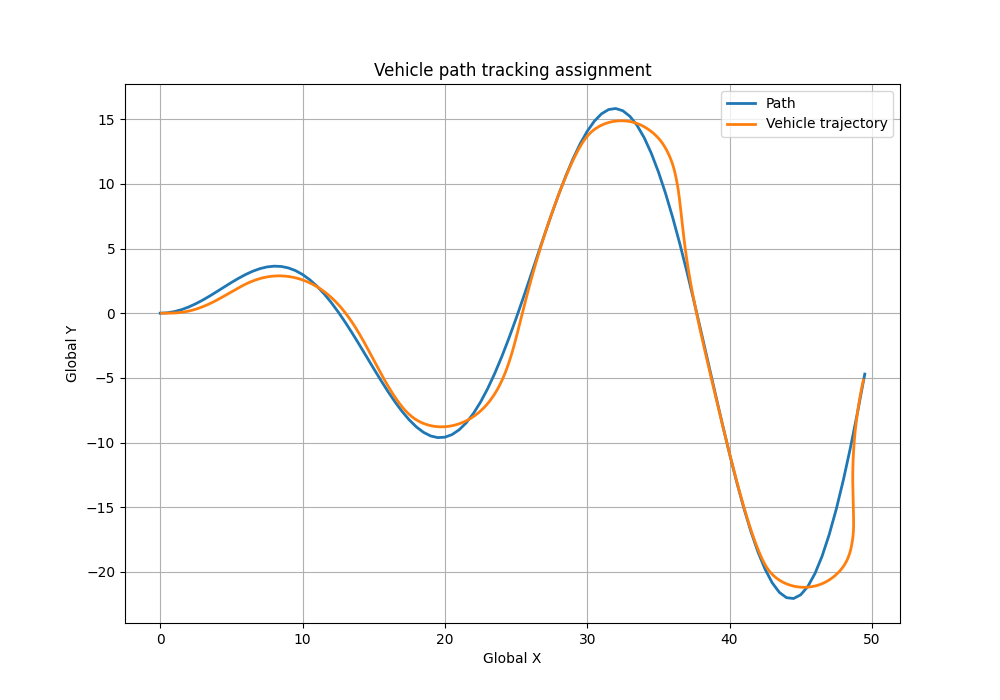
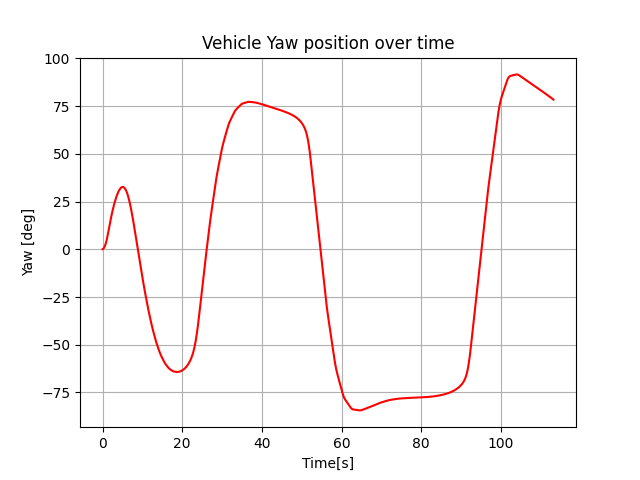
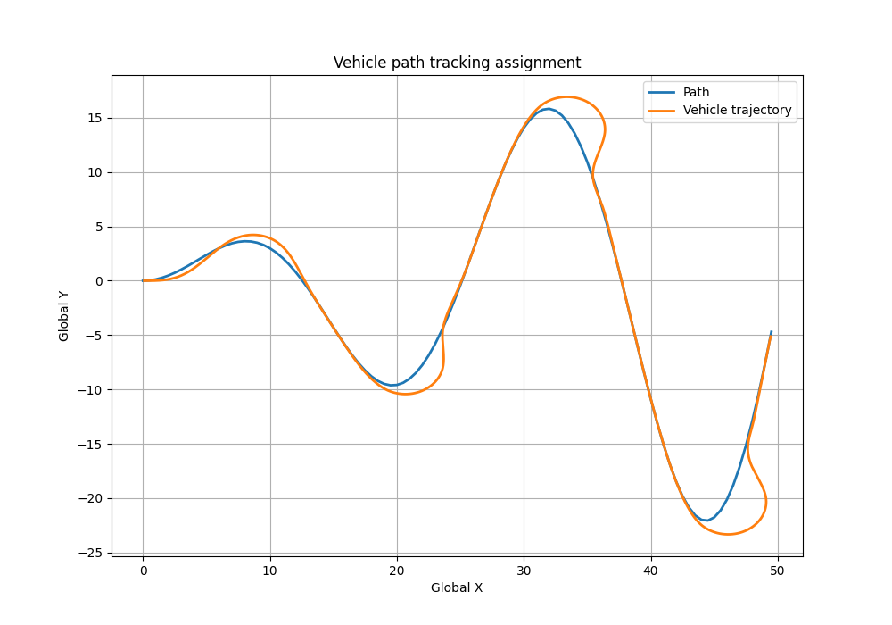
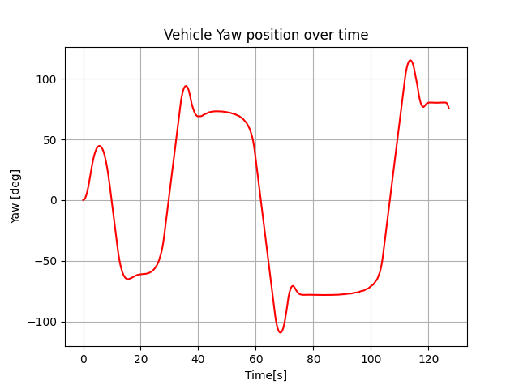

# VehicleDynamicsSimulation_Assignment
Vehicle Dynamic simulation - Entry Programming Assignment

This assignment is a simualtion of path tracking vehicle (bicycle kinematic model) using two kind of algorithms: Pure Pursuit and stanley controller.

To run the simulation, open command line from the project's dicrectory path and run the following command:
```terminal
python3 main.py -x0 0 -y0 0 -psi 0 -v 1.0
 ```
 You can set differnt initial values for the vehicle.
 It is recommended to install the requirments.txt file before running for making sure you don't miss any needed module. Install the requirments.tx file, by running the following command (command line), from the assignment folder path:
 ```terminal
  pip install -r requirements.txt
 ```

Explanation of classes in this assignment:

### 1. Path - Consturcting the path of which is the tarcking target
Input: Path length along the x axis
Output: List of tupels - Global coordinates, (x,y), in a shape of a sinus based graph.

### 2. Vehicle - A mobile system who is able to move on a 2D space, contains the properties which help describe its kinematic behivour
Inputs: Initial global position (x0, y0), initial heading (psi), initial speed (v)
Functions: Upddate state according to kinematic bicycle model, send target steering angle and speed, global and ego coordinates transition.

### 3. ServoDynamics - The class simulate a steering servo as a 2nd order closed-loop system
Inputs: Max angle, angle rate limit, time deley, omega, zeta, integration step size
Functionallty: This class combines all the functunallty needed for applying the servo model. The 2nd order closed loop model is:
\[ \ddot{\delta} = \omega_{\delta}^2 \left( \delta_{\text{command}} - (\delta + \delta_{\text{bias}}) \right) - 2 \zeta_{\delta} \omega_{\delta} \dot{\delta} \]

### 4. PurePursuitAlgo - The path tracking algorithm "Pure Pursuit"
Inputs: Path object, vehicle object, look ahead distance
Functionallty: Calculates the steering angle target for the next step

### 5. StanleyController - Another path tracking algorithm "Stanley"
Inputs: Path object, vehicle object, controller gain, look ahead distance
Functionallty: Calculates the steering angle target for the next step

Other then that, the "Simulation.py" file, contains the needed code for illustarting an animation, and producing informating graph when the simuklation is finished.

For convience, here are the outcome of running the project:

## Pure Pursuit path tracking and Vehicle's yaw angle vs time
 

## Stanley controller path tracking and Vehicle's yaw angle vs time
 

